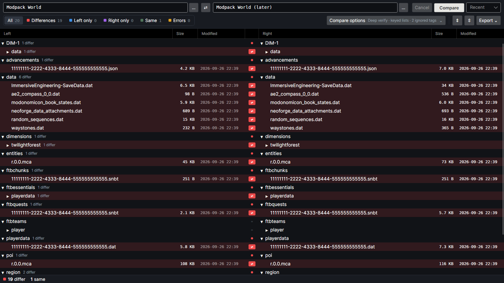
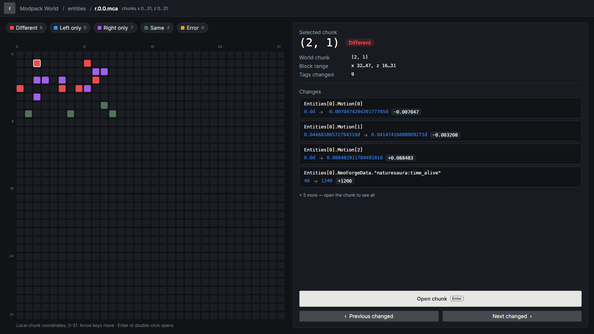
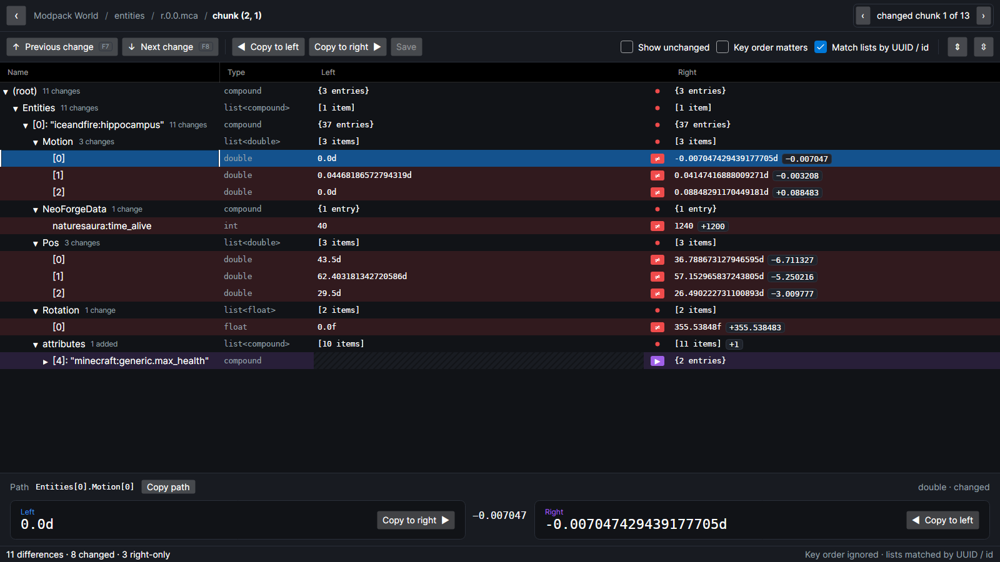
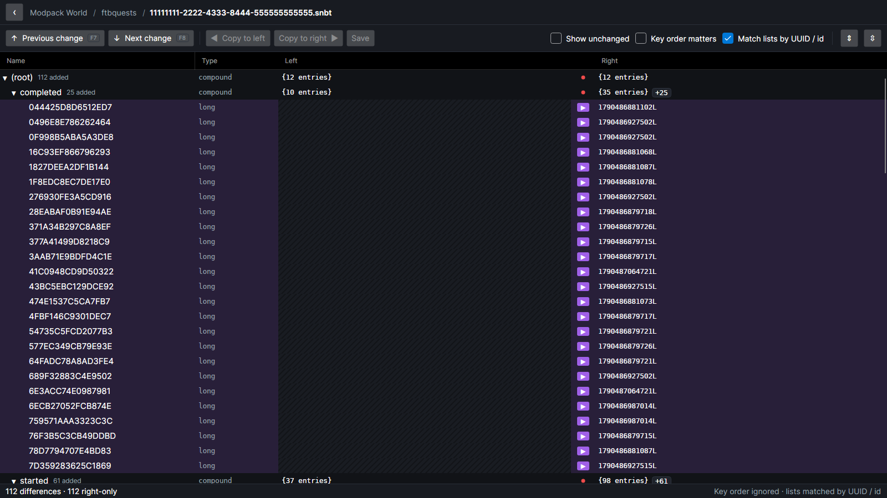

# nbt-diff

Compare Minecraft worlds and NBT files side by side, the way Beyond Compare or WinMerge compares
folders and text. Point it at two copies of a world and see which files, chunks and tags actually
changed; open any of them for a tag-level diff; copy values across and save them back.

Built for modded Java Edition worlds as much as vanilla: FTB-style `.snbt` quest and config files
are read, and reordered entity or item lists are matched by identity instead of position.

Runs on Windows and Linux.



## Features

- **World compare.** Two world folders side by side as a tree with per-row states (same /
  different / left only / right only / unreadable). Collapsed folders take the colour of what is
  inside them and show their counts; filters with counts show only differences, one side, or errors.
- **Only real differences.** Chunk timestamps, region sector layout and recompression are not
  differences. A fast byte-level pass finds candidates, then only those files are parsed and
  compared by content. Tags that change on every save (`LastUpdate`) are ignored by default.
- **Region view.** A 32×32 grid of a region file's chunks, coloured by state, with a panel that
  shows the selected chunk's world coordinates and its first few changes before you open it. The
  legend doubles as a filter; open any chunk for its tag diff and step through the changed chunks
  with `Ctrl+F7` / `Ctrl+F8`.
- **Tag diff.** An aligned tree of both sides: changed values (with the numeric delta), added and
  removed tags, type changes, array differences. Lists of entities, block entities and items are
  matched by UUID, position or id, so a reordered list is not reported as changed. The selected
  tag's full values and NBT path sit in a detail pane.
- **Text diff** for the other files in a world or modpack (`.json`, `.toml`, `.cfg`, `.properties`,
  `.yml`, logs…).
- **Export** a folder compare as a text or JSON report.
- **Copy and save.** Copy a value or a whole subtree from one side to the other, WinMerge-style,
  and save the edited side back to its file or region.
- **Corrupt files don't stop a scan.** They show as an error row with the reason. (`.snbt` files
  that hold only comments, which FTB leaves behind, are compared as text.)
- **Formats:** Java NBT (`level.dat`, player data, `.nbt`, `.schematic`/`.litematic` and other
  gzip/zlib/uncompressed NBT), region files (`.mca`, `.mcr`, external `.mcc` chunks), SNBT including
  FTB's dialect, and Bedrock NBT / `level.dat` (compare only).

<table>
<tr>
<td></td>
<td></td>
</tr>
<tr>
<td align="center">Region view: which chunks changed, and what changed in the selected one</td>
<td align="center">Chunk tag diff with value deltas and the detail pane</td>
</tr>
</table>



## Download

Get the latest build from the [Releases](../../releases) page. Each release has two builds per
platform:

| File | What it is |
| --- | --- |
| `nbtdiff-<version>-win-x64.zip` / `nbtdiff-<version>-linux-x64.tar.gz` | **Standalone.** Unzip and run. Most people want this. |
| `…-needs-dotnet10.zip` / `…-needs-dotnet10.tar.gz` | Half the size, but needs the [.NET 10 runtime](https://dotnet.microsoft.com/download/dotnet/10.0) installed. |

Windows SmartScreen will warn that the program is from an unknown publisher; the builds are not
code-signed. Choose "More info" → "Run anyway". On Linux, `chmod +x nbtdiff` if your archive tool
dropped the executable bit.

## Usage

Start it with no arguments for an empty folder view, or pass two paths:

```text
nbtdiff                              empty folder view
nbtdiff <left-world> <right-world>   folder compare, scan starts immediately
nbtdiff <left.mca> <right.mca>       chunk grid; open a chunk for its tag diff
nbtdiff <left.dat> <right.dat>       tag diff (also .nbt, .snbt, schematics)
nbtdiff <left.json> <right.json>     side-by-side line diff (also .txt .properties .log …)
```

One side may be a path that does not exist; it is shown as entirely missing. The startup folder
view also compares two files: type two file paths, or pick them with the `…` button's "File…"
entry, and press Compare.

### Folder view

Row states: red `≠` different · dashed `≠?` bytes differ but content not yet verified · blue `◀`
left only · purple `▶` right only · faint `=` same · struck through = unreadable. Double-click a
file to open it; the breadcrumb at the top leads back to any level (or press `Esc`), and a folder
scan keeps its state when you come back.

The status bar says which pass is running: `Pass 1 of 2 · hashing bytes` reads every file once
without decompressing; `Pass 2 of 2 · verifying content n/m` parses only the files whose bytes
differed. Until pass 2 has settled a row (or with Deep verify off) it shows `≠?`, never `≠`.
Opening such a region verifies it and says so in the header when every chunk turns out identical.

Compare options (the button above the tree, which also shows the current settings):

- **Ignore tags** — tag paths that are not content. Default `LastUpdate, Level/LastUpdate`; add
  `InhabitedTime` if you want that ignored too.
- **Match list items by key** (on by default) — pairs entities by UUID, block entities by position
  and items by id, in the scan, the chunk grid and the tag view alike.
- **Deep verify** — run pass 2. Off gives a faster, byte-only scan.

### Keyboard

| Key | Folder view | Region grid | Tag / text view |
| --- | --- | --- | --- |
| `Enter` / double-click | open file, toggle folder | open chunk | toggle node |
| `→` / `←` | expand / collapse | move selection | expand / collapse |
| `↑` `↓` | move | move selection | move |
| `F8` / `F7` | — | — | next / previous change (wraps) |
| `Ctrl+F8` / `Ctrl+F7` | — | — | next / previous changed chunk of the region (chunk views only) |
| `Alt+→` / `Alt+←` | — | — | copy the selected row's value or subtree to the other side |
| `Ctrl+S` | — | — | save edited side(s) |
| `Esc` / breadcrumb | | back to the previous view, or any earlier level | |

## Editing and saving

In the tag view, `◀ Copy to left` / `Copy to right ▶` copy the selected row (a single value or a
whole subtree, into an existing or a missing side alike) from one side to the other, and the diff
refreshes immediately. Edits stay in memory until `Ctrl+S` writes each edited side back:

- `.dat` files are rewritten in their original compression. `.snbt` files (FTB Quests, Teams,
  Chunks and other mod configs) are not rewritten at all: only the text of the values you changed is
  replaced, in the file's own style, so comments, key order, indentation and number formatting stay
  exactly as they were. A change that cannot be written that way is refused rather than reformatting
  the file.
- The new file is written beside the old one and swapped in only once it is complete, so a failed or
  interrupted save leaves the original as it was.
- A chunk is re-appended to its region file the way Minecraft itself saves; the chunk keeps its
  compression scheme, and the region header is only pointed at it once it is on disk. Copying a
  missing chunk over an existing one deletes that chunk, as Minecraft does.
- The first save of any file or region keeps the untouched original as `<file>.bak`
  (`r.0.0.mca.bak`, `level.dat.bak`, …). Later saves leave that backup alone.
- Bedrock files are compared but not written.

Going Back, stepping to another chunk, or closing the window with unsaved copies asks before
discarding them.

**Before you save anything, back up the world, and close it in Minecraft** (or stop the server).
Minecraft keeps its own copy of loaded chunks in memory and will overwrite your change, or worse,
when it next saves. nbt-diff refuses to save into a world whose `session.lock` is held by
Minecraft or a server, and the first save of each session asks you to confirm you have a backup.

## Settings

Options, recent pairs and window placement persist in `%APPDATA%\nbtdiff\settings.json` on Windows
and `~/.config/nbtdiff/settings.json` on Linux. Exclude globs (default `session.lock`) are only
editable in that file for now.

## Building from source

Requires the .NET 10 SDK.

```bash
dotnet build          # warnings are errors
dotnet test
dotnet run --project src/NbtDiff.App -- <left> <right>
```

Single-file binaries:

```bash
dotnet publish src/NbtDiff.App -p:PublishProfile=win-x64                        # needs .NET 10 → publish/win-x64/
dotnet publish src/NbtDiff.App -p:PublishProfile=linux-x64 -p:SelfContained=true   # standalone → publish/linux-x64-standalone/
```

CI builds and tests on Windows and Ubuntu on every push and pull request. Pushes to `master`, `v*`
tags and manual runs also publish all four builds as workflow artifacts; a `v*` tag creates a
GitHub release with them attached (`v0.*` tags are marked pre-release).

## License

MIT, see [LICENSE](LICENSE). Third-party components and their licenses are listed in
[third_party/NOTICE](third_party/NOTICE), which also ships in every release archive as
`THIRD-PARTY-NOTICES.txt`.

NOT AN OFFICIAL MINECRAFT PRODUCT. NOT APPROVED BY OR ASSOCIATED WITH MOJANG OR MICROSOFT.
